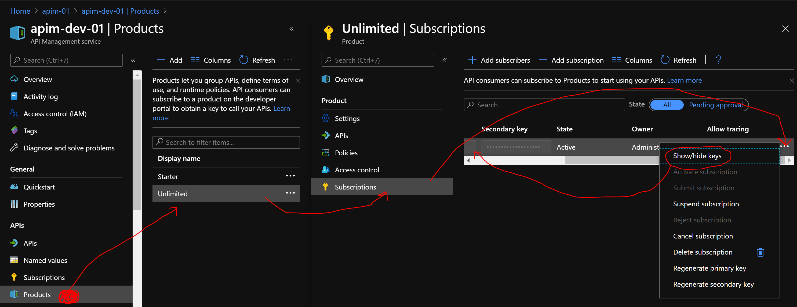

# Azure Function Queue Trigger

## Situation

A data producer pushes information to an Azure Queue Storage. Then pushes the information to a Rest API Service.

## Tasks

Be able to develop the solution locally, then deploy to Azure. We need to get access to the remote server.
In this case we are using Azure API Management.

Products -> Unlimited -> APIs -> Add -> Select_the_API -> Save
(On the sabe blade, go to Subscriptions) -> at the "..." on the corner left click to "Show/hide keys" -> Copy your "apimprodIdConf".

Alternatively:
Products -> Unlimited -> APIs -> Add -> Select_the_API -> Subscription -> at the "..." on the corner left click to "Show/hide keys" -> Copy your "apimprodIdConf".



```json
{
  "IsEncrypted": false,
  "Values": {
    "AzureWebJobsStorage": "DefaultEndpointsProtocol=https;AccountName=mystoragemae;AccountKey=AAABBBzzzZZ==;EndpointSuffix=core.windows.net",
    "FUNCTIONS_WORKER_RUNTIME": "dotnet",
    "apimUrlConf": "https://Gateway URL/REST_API_CONTEXT",
    "apimprodIdConf": "a..............................z"
  },
  "Host": {
    "LocalHttpPort": 7071,
    "CORS": "*",
    "CORSCredentials": false
  }
}
```

## Actions

## Results

The data will go to from Azure API Managment via custom policy to Azure Event Hubs. Then a function will consume the Event Hubs and post the data on Azure Log Analytics.

References:
<https://docs.microsoft.com/en-us/azure/azure-functions/functions-bindings-storage-queue-trigger?tabs=csharp>